<h2 align="left">Hola 👋 Soy Steven Patiño, Data Analyst & Data Engineer en formación 🇨🇴</h2>

###

<div align="center">
  
</div>

###


###

### 🧠 Sobre mí

- 🎓 Finalizando estudios en **[Riwi](https://github.com/Riwi-io-Medellin)** — Medellín, Colombia
- 📊 Apasionado por el **análisis de datos**, la **ingeniería de datos** y el **machine learning**
- 🌱 Actualmente aprendiendo **Data Science** y profundizando en pipelines de datos
- 💬 Pregúntame sobre **Python, PostgreSQL, Spark, Airflow, n8n o análisis exploratorio**
- 🤝 Abierto a colaborar en proyectos de datos con impacto real
- ☕ Tomando café y convirtiendo datos en decisiones desde Colombia

###

<div align="center">
  
  
</div>

<div align="center">
  
  
</div>

###

### 🛠️ Tecnologías y Herramientas

<!-- Terminal animada flotando a la derecha -->


**Lenguajes**

<div align="left">
  
  
  
  
  
  
  
  
  
</div>

**Frameworks & APIs**

<div align="left">
  
  
  
  
  
</div>

**Bases de Datos**

<div align="left">
  
  
  
</div>

**Ingeniería de Datos & Orquestación**

<div align="left">
  
  
  
  
  
  
  
  
  
</div>

**Cloud & DevOps**

<div align="left">
  
  
  
  
  
  
  
</div>

<br clear="both"/>

###

### 📊 Stack de Datos

```text
Análisis          ██████████████████░░   Python (Pandas, NumPy, Matplotlib, Seaborn)
Bases de Datos    ████████████████░░░░   PostgreSQL · MongoDB
Pipelines         ██████████████░░░░░░   Airflow · Celery · RabbitMQ · n8n
Big Data          ████████████░░░░░░░░   Apache Spark
Cloud             ██████████░░░░░░░░░░   AWS
Data Science      ████████░░░░░░░░░░░░   En aprendizaje activo 🚀
```

###

### 📫 Contáctame

<div align="left">
  <a href="mailto:dev.stevenpatino@gmail.com">
    
  </a>
  <a href="https://www.linkedin.com/in/steven-alexander-pati%C3%B1o-arenas-7710b93b9/">
    
  </a>
  <a href="https://github.com/Steven-Patino">
    
  </a>
</div>

###

<br clear="both">

<picture>
  <source media="(prefers-color-scheme: dark)" srcset="https://raw.githubusercontent.com/Steven-Patino/Steven-Patino/output/github-snake-dark.svg" />
  <source media="(prefers-color-scheme: light)" srcset="https://raw.githubusercontent.com/Steven-Patino/Steven-Patino/output/github-snake.svg" />
  
</picture>
