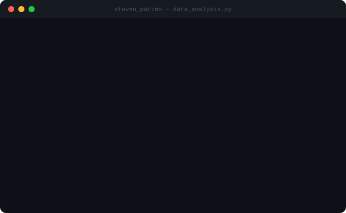

 

###

  

###

### 🧠 Sobre mí

- 🎓 Finalizando estudios en **[Riwi](https://github.com/Riwi-io-Medellin)** — Medellín, Colombia
- 📊 Apasionado por el **análisis de datos**, la **ingeniería de datos** y el **machine learning**
- 🌱 Actualmente aprendiendo **Data Science** y profundizando en pipelines de datos
- 💬 Pregúntame sobre **Python, PostgreSQL, Spark, Airflow, n8n o Power BI**
- 🤝 Abierto a colaborar en proyectos de datos con impacto real
- ☕ Tomando café y convirtiendo datos en decisiones desde Colombia

###

  
  

  
  

###

### 🛠️ Tecnologías y Herramientas

**Lenguajes**

  
  
  
  
  
  
  
  
  

**Frameworks & Estilos**

  
  
  
  
  
  
  

**Bases de Datos**

  
  
  
  
  

**Ingeniería de Datos & Orquestación**

  
  
  
  
  
  
  
  
  

**Visualización de Datos**

  
  
  
  
  
  
  

**Cloud & DevOps**

  
  
  
  
  
  
  
  
  

 

###

### 📫 Contáctame

  
  
  

###

 

<picture>
  <source media="(prefers-color-scheme: dark)" srcset="https://raw.githubusercontent.com/Steven-Patino/Steven-Patino/output/github-snake-dark.svg" />
  <source media="(prefers-color-scheme: light)" srcset="https://raw.githubusercontent.com/Steven-Patino/Steven-Patino/output/github-snake.svg" />
  
</picture>

