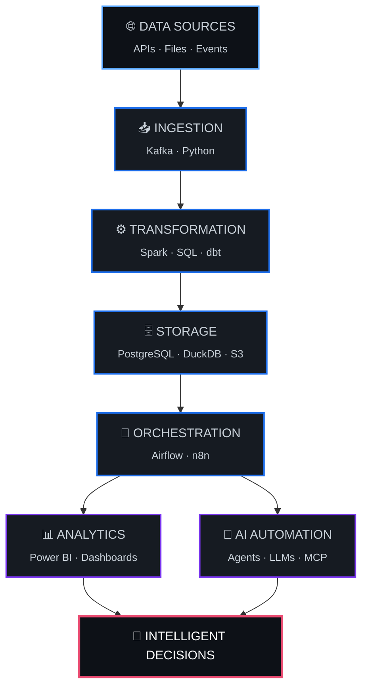

<div align="center">

<!-- ═══════════════ HEADER ANIMADO ═══════════════ -->


<!-- ═══════════════ TYPING ANIMADO ═══════════════ -->


<br>

<!-- ═══════════════ SOCIAL + CONTADORES ═══════════════ -->

<a href="https://www.linkedin.com/in/steven-alexander-pati%C3%B1o-arenas-7710b93b9/">
  
</a>
<a href="https://github.com/Steven-Patino">
  
</a>
<a href="mailto:dev.stevenpatino@gmail.com">
  
</a>


<br>


<br><br>


### `DATA` • `ENGINEERING` • `INTELLIGENCE` • `AUTOMATION`

> **Designing data-driven systems that transform raw information into reliable insights, scalable pipelines and intelligent workflows.**


</div>

<br>

##  About Me


```python
class StevenPatino:
    def __init__(self):
        self.role     = "Data Analyst | Data Engineer | AI Automation"
        self.location = "Colombia 🇨🇴"
        self.focus    = ["Data Pipelines", "Real-Time Analytics", "AI Agents"]
        self.stack    = ["Python", "SQL", "Spark", "Kafka", "Airflow", "n8n"]

    def lifecycle(self):
        return ("Ingestion → Transformation → Orchestration "
                "→ Analytics → Automation → Intelligence")

    def mission(self):
        return "Make data flow automatically and decisions happen intelligently."
```

Soy **Steven Patiño**, y construyo soluciones en la intersección entre **Data Analytics, Data Engineering e Inteligencia Artificial**. Mi objetivo es convertir datos complejos y procesos repetitivos en **sistemas confiables, automatizados y escalables**.

<br clear="right"/>

<div align="center">


</div>

##  What I Build

<table align="center">
<tr>
<td width="33%" align="center" valign="top">

### 📊 Data Analytics

<sub>Turning raw data into actionable insights.</sub>


</td>

<td width="33%" align="center" valign="top">

### 🏗️ Data Engineering

<sub>Designing reliable and scalable pipelines.</sub>


</td>

<td width="33%" align="center" valign="top">

### 🤖 AI Automation

<sub>Automating workflows with intelligent systems.</sub>


</td>
</tr>
</table>

<div align="center">


</div>

##  Core Expertise

<div align="center">

| Domain | Focus |
| :--- | :--- |
| 📊 **Analytics** | Business Intelligence · KPI Analysis · Dashboards · Data Storytelling |
| 🏗️ **Data Engineering** | ETL/ELT Pipelines · Data Transformation · Distributed Processing |
| ⚡ **Streaming** | Event-Driven Architecture · Real-Time Data · Apache Kafka |
| 🔄 **Orchestration** | Apache Airflow · Workflow Automation · Scheduled Pipelines |
| 🤖 **AI Automation** | AI Agents · LLM Workflows · Intelligent Process Automation |
| ☁️ **Cloud** | AWS · Containerized Workloads · Infrastructure Automation |
| 🗄️ **Data Platforms** | PostgreSQL · MongoDB · DuckDB · Data Warehousing |
| 📈 **Visualization** | Power BI · Matplotlib · Plotly · Analytical Dashboards |


</div>

##  Technology Stack

<div align="center">


<br><br>

<details open>
<summary><b>🐍 Languages &nbsp;·&nbsp; 📊 Analytics &nbsp;·&nbsp; 🏗️ Engineering &nbsp;·&nbsp; 🤖 AI &nbsp;·&nbsp; ☁️ Cloud</b> &nbsp;<sub>(click para expandir/colapsar)</sub></summary>

<br>

**Languages**


**Analytics & BI**


**Data Engineering**


**Databases & Storage**


**AI Automation & Agents**


**Cloud, DevOps & Infrastructure**


</details>

</div>

<sub>💡 **OpenClaw** es especialmente relevante para mi enfoque de automatización: es un asistente/gateway de IA self-hosted que conecta agentes con herramientas, canales, workflows y acciones reales. **Hermes Agent** añade otra capa mediante ejecución agéntica, memoria, skills, uso de herramientas y tareas autónomas.</sub>

<div align="center">


</div>

##  Data Architecture in Motion


```mermaid
flowchart TD
    A["🌐 DATA SOURCES<br/><sub>APIs · Files · Events</sub>"] --> B["📥 INGESTION<br/><sub>Kafka · Python</sub>"]
    B --> C["⚙️ TRANSFORMATION<br/><sub>Spark · SQL · dbt</sub>"]
    C --> D["🗄️ STORAGE<br/><sub>PostgreSQL · DuckDB · S3</sub>"]
    D --> E["🔄 ORCHESTRATION<br/><sub>Airflow · n8n</sub>"]
    E --> F["📊 ANALYTICS<br/><sub>Power BI · Dashboards</sub>"]
    E --> G["🤖 AI AUTOMATION<br/><sub>Agents · LLMs · MCP</sub>"]
    F --> H["🧠 INTELLIGENT DECISIONS"]
    G --> H

    classDef source fill:#0D1117,stroke:#58A6FF,stroke-width:2px,color:#C9D1D9
    classDef process fill:#161B22,stroke:#1F6FEB,stroke-width:2px,color:#C9D1D9
    classDef output fill:#161B22,stroke:#7A36F0,stroke-width:2px,color:#C9D1D9
    classDef final fill:#0D1117,stroke:#EA4B71,stroke-width:3px,color:#FFFFFF

    class A source
    class B,C,D,E process
    class F,G output
    class H final
```

<div align="center">


</div>

##  Current Focus

<div align="center">

`DATA ENGINEERING` • `REAL-TIME DATA` • `AI AGENTS` • `AUTOMATION` • `CLOUD`

</div>

<table>
<tr>
<td width="50%" valign="top">

**🏗️ Advanced Data Engineering**
<br><sub>Arquitecturas ETL/ELT, pipelines de datos y sistemas de procesamiento escalables.</sub>


</td>
<td width="50%" valign="top">

**⚡ Real-Time Analytics**
<br><sub>Arquitecturas event-driven y streaming con Apache Kafka y Spark.</sub>


</td>
</tr>
<tr>
<td width="50%" valign="top">

**🤖 AI-Powered Automation**
<br><sub>Workflows donde los agentes analizan, deciden y ejecutan tareas.</sub>


</td>
<td width="50%" valign="top">

**🧩 Intelligent Data Platforms**
<br><sub>Analytics + engineering + sistemas agénticos end-to-end.</sub>


</td>
</tr>
</table>

<div align="center">


</div>

# 📈 GitHub Analytics

<div align="center">


<br><br>


<br><br>


</div>

---


<!-- 🐍 Contribution Snake -->
<picture>
  <source media="(prefers-color-scheme: dark)" srcset="https://raw.githubusercontent.com/Steven-Patino/Steven-Patino/output/github-snake-dark.svg" />
  <source media="(prefers-color-scheme: light)" srcset="https://raw.githubusercontent.com/Steven-Patino/Steven-Patino/output/github-snake.svg" />
  
</picture>


</div>

##  The Long-Term Vision

```text
   Data Analytics  ──▶  Data Engineering  ──▶  Streaming & Distributed Systems
                                                          │
                                                          ▼
   Intelligent Decisions  ◀──  Process Automation  ◀──  AI Agents
```

<div align="center">

**Mi meta a largo plazo:** construir sistemas donde **los datos fluyan automáticamente, los insights se generen de forma inteligente y los procesos repetitivos los ejecuten agentes de software en lugar de personas.**


</div>

##  Let's Connect

<div align="center">

<a href="https://www.linkedin.com/in/steven-alexander-pati%C3%B1o-arenas-7710b93b9/">

</a>
<a href="mailto:dev.stevenpatino@gmail.com">

</a>
<a href="https://github.com/Steven-Patino">

</a>

<br><br>


<br>


</div>
